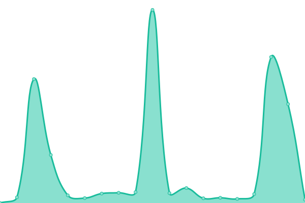

# [📈 Live Status](https://Discord-Development-Centre.github.io/status): <!--live status--> **🟧 Partial outage**

This repository contains the open-source uptime monitor and status page for [Discord-Development-Centre](https://Discord-Development-Centre.github.io/status), powered by [Upptime](https://github.com/upptime/upptime).

With [Upptime](https://upptime.js.org), you can get your own unlimited and free uptime monitor and status page, powered entirely by a GitHub repository. We use [Issues](https://github.com/Discord-Development-Centre/status/issues) as incident reports, [Actions](https://github.com/Discord-Development-Centre/status/actions) as uptime monitors, and [Pages](https://Discord-Development-Centre.github.io/status) for the status page.

<!--start: status pages-->
<!-- This summary is generated by Upptime (https://github.com/upptime/upptime) -->
<!-- Do not edit this manually, your changes will be overwritten -->
<!-- prettier-ignore -->
| URL | Status | History | Response Time | Uptime |
| --- | ------ | ------- | ------------- | ------ |
|  [Master Bot](https://MasterBot.DLCDevelopment.repl.co) | 🟩 Up | [master-bot.yml](https://github.com/Discord-Development-Centre/status/commits/HEAD/history/master-bot.yml) | 

 2409ms
     
 | 

<a href="https://Discord-Development-Centre.github.io/status/history/master-bot">97.99%</a>
    

|  [DLC Bot](https://dlc-bot.samosaman73.repl.co) | 🟥 Down | [dlc-bot.yml](https://github.com/Discord-Development-Centre/status/commits/HEAD/history/dlc-bot.yml) | 

 3902ms
     
 | 

<a href="https://Discord-Development-Centre.github.io/status/history/dlc-bot">0.00%</a>
    

|  [TSU](https://TSU.DLCDevelopment.repl.co) | 🟥 Down | [tsu.yml](https://github.com/Discord-Development-Centre/status/commits/HEAD/history/tsu.yml) | 

 657ms
     
 | 

<a href="https://Discord-Development-Centre.github.io/status/history/tsu">0.00%</a>
    

|  [NES](https://NES.DLCDevelopment.repl.co) | 🟥 Down | [nes.yml](https://github.com/Discord-Development-Centre/status/commits/HEAD/history/nes.yml) | 

 3125ms
     
 | 

<a href="https://Discord-Development-Centre.github.io/status/history/nes">0.00%</a>
    

<!--end: status pages-->

[**Visit our status website →**](https://Discord-Development-Centre.github.io/status)

## 📄 License

- Powered by: [Upptime](https://github.com/upptime/upptime)
- Code: [MIT](./LICENSE) © [Discord-Development-Centre](https://Discord-Development-Centre.github.io/status)
- Data in the `./history` directory: [Open Database License](https://opendatacommons.org/licenses/odbl/1-0/)
